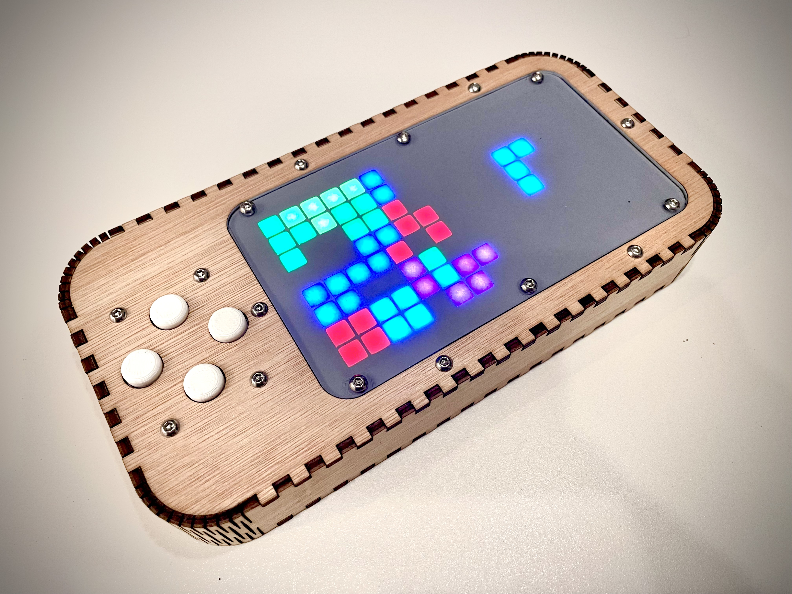
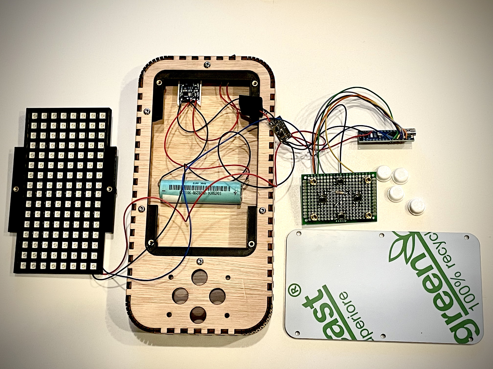

# Tetris

I made this Tetris game console as a secret santa present for organized for the Facebook group [Make in Belgium](https://www.facebook.com/groups/makeinbelgium/)

The game console was made out of:
- lasercut 
  - 3.6mm plywood for the enclosure
  - 3mm tinted plexiglass for the screen
- 3D printed PLA:
  - a grid for holding the leds and mounting plates
  - USB charger 
  - the buttons
- Some electronic components
  - an arduino nano (or any other arduino)
  - TP4056 Lithium Battery Charger Module
  - a DC/DC Lithium Battery Boost Module Step Up Board
  - two WS2812 Led 5050 Rgb 8X8 64 Led Matrices
  - a 4cm x 6cm prototyping PCB
  - tactile switches (6x6x7mm)
  - a passive electronic buzzer
  - 4 M3 x 5 mm spacers
  - 1 MiMoo On/Off rocker switch
  - a (recycled from an old laptop) 18650 Li-Ion battery
- some threaded inserts (ruthex RX-M3x5.7 Brass) and M3x6mm bolts with button head socket

